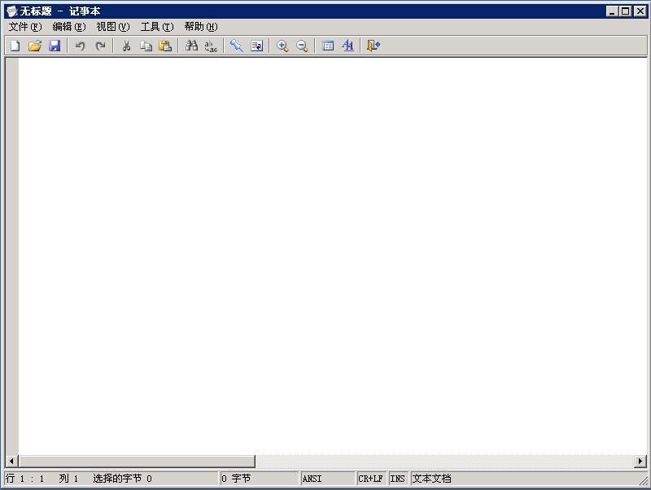
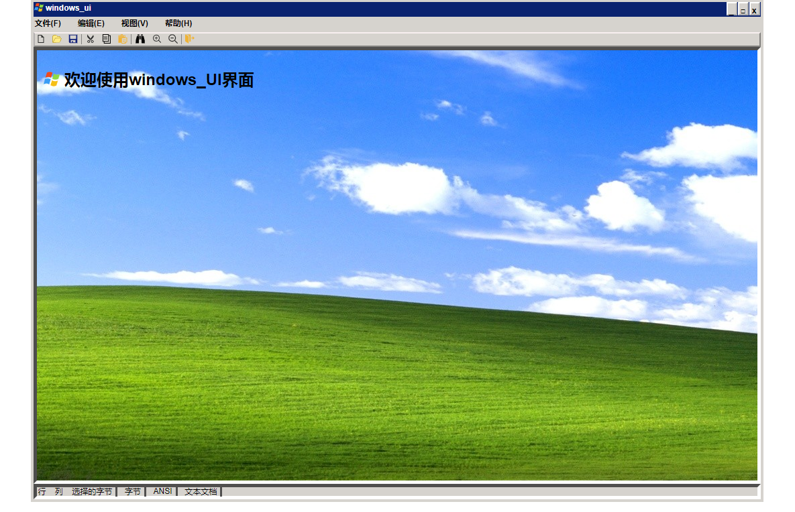

# windows-windows-ui[网页仿windows_UI界面]
### 原版UI


### 實現效果UI



## 使用技術: HTML5\CSS3\JS
## 第三方库: 无
## 兼容性: chrome\edge\safari\firefox 移动端百分比响应式
## 简介:
封装的windows_ui_frames,可以进行类windows 95相关网页开发
## 具体功能:
1.封装弹出菜单(点击、划过事件)
2.封装多级菜单(点击、划过事件)
3.封装开启/关闭对话框事件
4.封装拖动窗口(长按1s)
5.封装拖拽功能(带磁吸模式)
## 具体用法
##### 1.添加应用标题和图标
```
<!-- 标题区 -->
<div class="title">
    <span>
        <!--应用图标 svg格式 icon_min表示长宽10px -->
        <svg class="icon icon_min" aria-hidden="true">
            <use xlink:href="#icon-windows"></use>
        </svg>
        windows_ui
    </span>
    <span class="pageBtn">
        <button>
            <p><b>_</b></p>
        </button>
        <button>
            <p><b>□</b></p>
        </button>
        <button>
            <p class="file_close"><b>x</b></p>
        </button>
    </span>
</div>
```
##### 2.添加菜单
1. data-class="view_scale" 表示当前菜单项对于的功能名
功能有两种:
* 需要弹出dialog对话框(这种需要在dialog下面继续写对话框页面)
* 不需弹出对话框就需要在js文件的 无dialog窗事件处理函数区写同名函数

2. has_sub_menu这个类名加上表面当前菜单项为多级菜单单击他会弹出下一级菜单，下一级菜单`<div class="subMenu"></div>`内书写 书写方式同第一项

3. `<span class="menu_item_actived">√</span>` 的 menu_item_actived表示当前选项有勾选来表示其状态
```
<!-- 菜单区 -->
 <div class="menu">  
     <span data-menu="view" class="menu_btn">视图(V)</span>
     <div class="view curMenu">
        <div class="item menu_item has_sub_menu" data-class="view_scale">
            <span>缩放</span><span>></span>
            <div class="subMenu">
                <div class="item menu_item" data-class="view_scale_zoom_in">
                    <span>放大</span><span>Ctrl+"+"</span>
                </div>
                <div class="item menu_item" data-class="view_scale_zoom_out">
                    <span>缩小</span><span>Ctrl+"-"</span></div>
                </div>
            </div>
            <div class="item menu_item" data-class="view_footerInfo">
                <span class="menu_item_actived">√</span><span>状态栏</span>
            </div>
            <hr>
            <div class="item menu_item" data-class="view_wrap">
                <span class="menu_item_actived">√</span>
                <span>自动换行</span>
            </div>
        </div>
      </div>
</div>
```
##### 2.添加菜单
```
<!-- 功能按钮区 -->
<div class="func">
       <span class="iconfont file_close">
            <svg class="icon icon_min" aria-hidden="true">
              use xlink:href="#icon-exit"></use>
            </svg>
      </span>
</div>
```
1. class="iconfont file_new" file_new表示其对应的功能函数名
需要在js的 功能区func点击事件
按此格式实现功能函数 
```
//file_new
var func_file_new = document.getElementsByClassName("file_new")[0];//获取func中的单击元素
//为点击元素绑定点击事件 处理函数需要在js文件的 无dialog窗事件处理函数区写同名函数实现
func_file_new.addEventListener("click", file_new);
```
##### 3. 业务显示区
```
<!-- 业务显示区 -->
div class="content">
    业务显示区也就是应用本体界面区
</div>
```
##### 4. 页脚信息区
1. 展示一些应用基本信息
```
<!-- 页脚信息区 -->
<div class="footerInfo">
      <span id="row_col">
          行<span id="row"></span>
          &nbsp;&nbsp;
          列<span id="col"></span>
          &nbsp;&nbsp;
          选择的字节<span id="selected"></span>
       </span>
       <span id="sizeBox">
          <span id="size"></span>字节
       </span>
       <span id="charSetBox">
          <span id="charSet">ANSI</span>
       </span>
       <span id="fileTypeBox">
          <span id="fileType">文本文档</span>
       </span>
</div>
```
##### 5.对话框区
1. 这个区域其实我们只提供最基础的
```
<div class="item edit_replace">
    <div class="title">当前对话框标题</div>
    <div class="func">
        实现界面
    </div>
</div>
```
实例:
```
<div class="dialog">
            <div class="item edit_replace">
                <div class="title">
                    <span>替换</span>
                    <span class="pageBtn">
                        <button class="closeBtn" data-dialog="edit_replace">
                            <p><b>x</b></p>
                        </button>
                    </span>
                </div>
                <div class="func">
                    <form id="replace_find" onsubmit="return find_replace_form_handle(this)">
                        <div class="funcLeft">
                            <div class="search">
                                <span>寻找目标:</span><input type="text" name="searchInput">
                                <br><br>
                                <span>取代为:&nbsp;&nbsp;&nbsp;&nbsp;</span><input type="text" name="replaceInput">
                            </div>
                            <div class="options">
                                <span><input type="checkbox" name="case_sensitive" id="case_sensitive" checked><label
                                        for="case_sensitive">大小写敏感</label></span>
                                <fieldset>
                                    <legend>方向</legend>
                                    <input type="radio" value="up" name="direction" id="up" /><label for="up">向上</label>
                                    <input type="radio" value="down" name="direction" id="down" checked /><label
                                        for="down">向下</label>
                                </fieldset>
                            </div>

                        </div>
                        <div class="funcRight">
                            <input name="submit" type="submit" value="下一个" style="width: 100%;">
                            <input name="submit" type="submit" value="取代" style="width: 100%;">
                            <!-- <input name="submit" type="submit" value="全部取代" style="width: 100%;"> -->
                            <button class="cancelFind" data-dialog="edit_replace">取消</button>
                        </div>
                    </form>
                </div>
            </div>
        </div>
```
