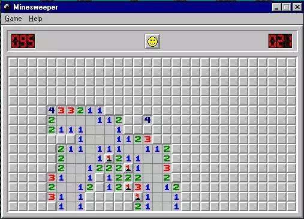

# windows-sweepMine[网页仿windows扫雷]
### 原版UI

### 實現效果UI

## 使用技術: HTML5\CSS3\JS
## 第三方库: 无
## 兼容性: chrome\edge\safari\firefox
## 简介:
基于个人封装的windows_ui_frames,使用HTML\CSS 还原扫雷,再使用原生js实现功能逻辑.
## 亮点:
1.实现纯前端的实现扫雷经典玩法,即通过点开方块的数字判断雷的位置.
2.使用递归方式寻找路径只能清除一系列相关的0方块
3.实现对游戏的重新开始\暂停\游戏排行
## 具体功能:
#### 文件:
1. 开始游戏
2. 暂停游戏
3. 游戏记录
4. 结束
#### 帮助:
1. 使用说明
2. 关于扫雷
#### 注意:
1.移动端使用长按方块代替右键插旗
